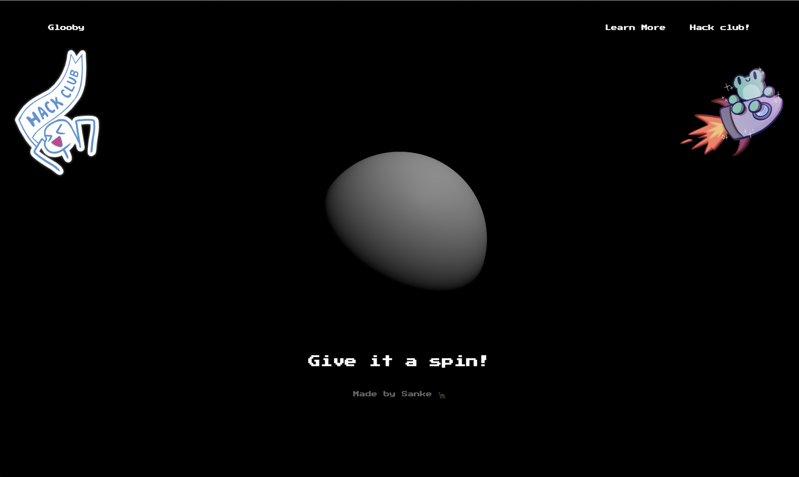

# Glooby - A three.js website
Hello there! This is a project i made to learn more about three.js :) It's not very complex but it taught me a lot about how models are rendered on a website using OpenGL.

You can see it for yourself at [glooby.greenbit.club](https://glooby.greenbit.club)!

# Features
- Popup
- Custom Cursor
- Animations using GSAP
- Custom google font

But sadly it is not responsive for devices with a **width screen size <= 768px**, so everytime someone wants to access it via a device that is not compatible, they will get a warning.
# Website preview

---
Feel free to explore the code and play around with it!